# Installing GPU Version of TensorFlow on Windows

* * *

## Requirements
* Python 3.6.2 or Anaconda 5.1
* CUDA® Toolkit 9.0
* cuDNN v7.0
* TensorFlow r1.5

## How to install
### Python
1. Download installer [Python 3.6.2](https://www.python.org/downloads/release/python-362/).
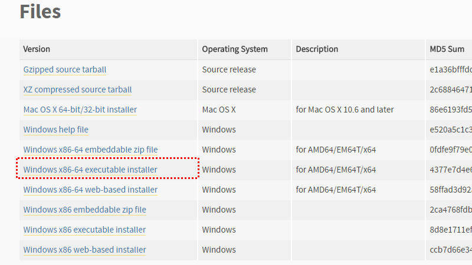
2. Execute downloaded installer.
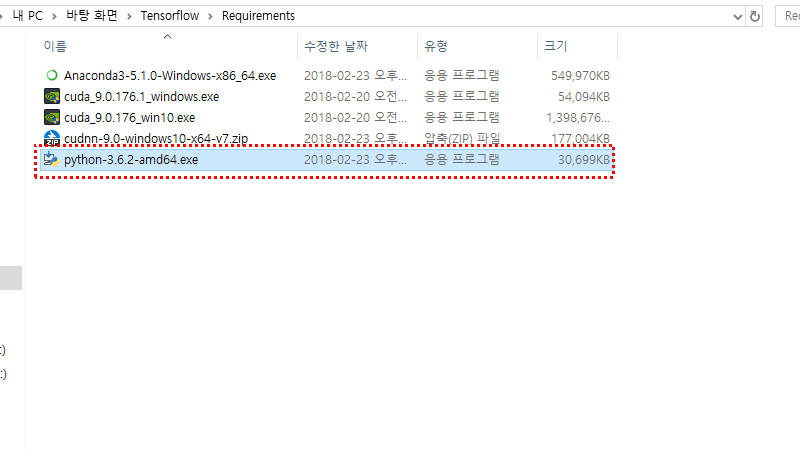
3. Check "Add Python 3.6 to Path" and click "Insall Now" button.
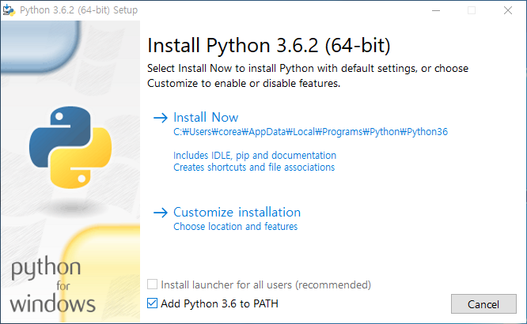
4. Click "Close" button and finish installation.
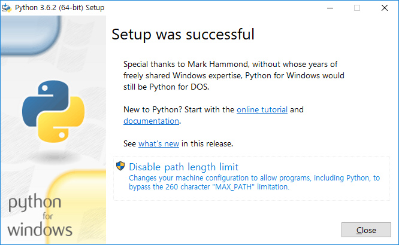

### CUDA® Toolkit
1. Download [CUDA Toolkit 9.0](https://developer.nvidia.com/cuda-90-download-archive) that matches your version.

2. Execute downloaded installer.
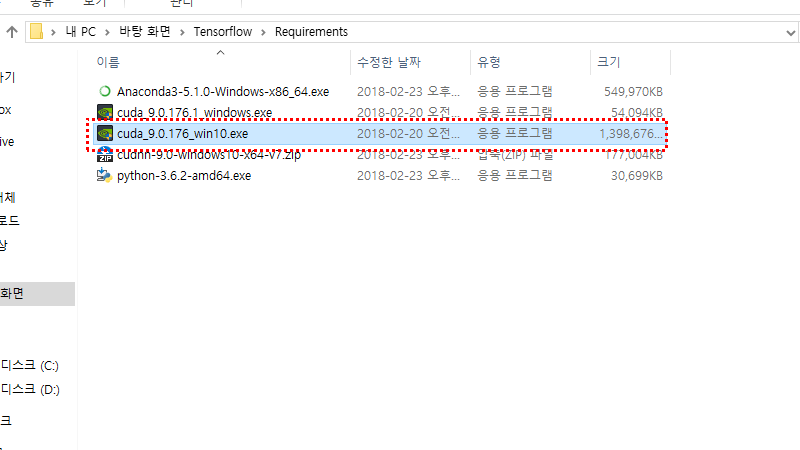
3. Click "OK" and "Next" to proceed with the installation.
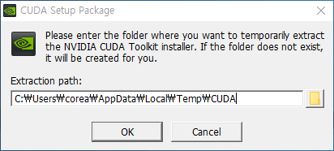
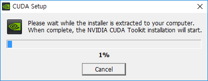

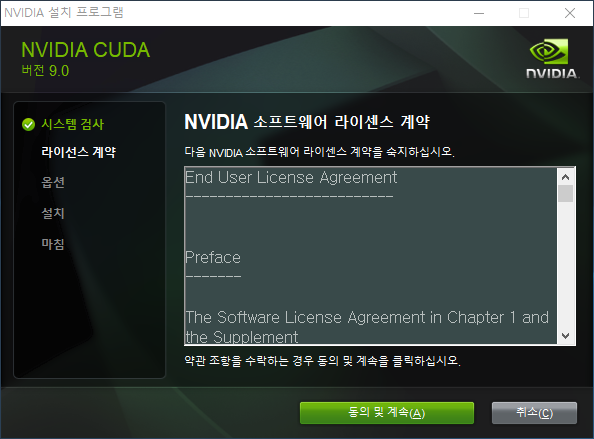

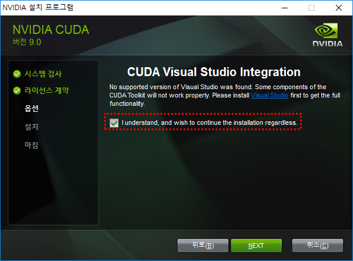

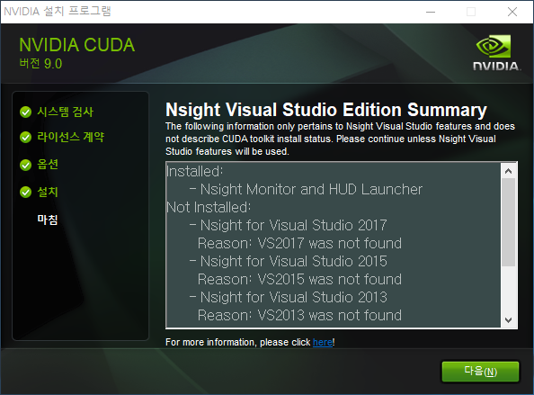

4. Execute patch file.
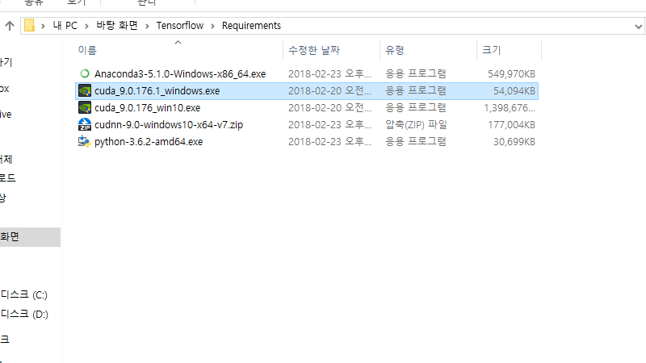
5. Click "OK" and "Next" to proceed with the installation.

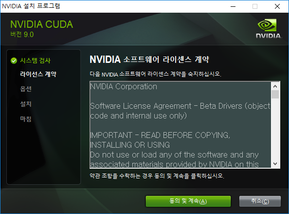
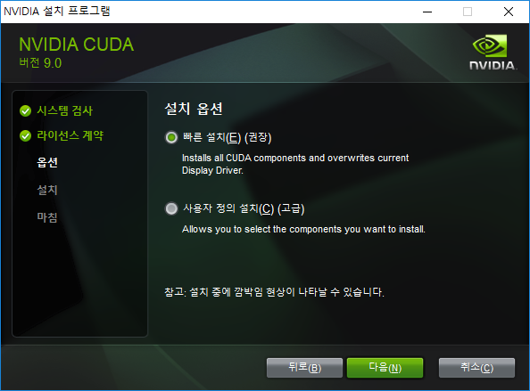
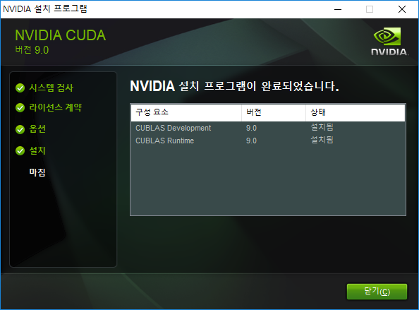
